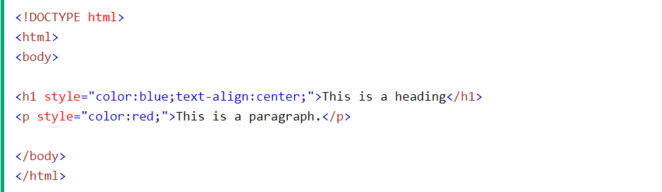

# What is CSS?
> **CSS** (**C**ascading **S**tyle **S**heets) allows you to create great-looking web pages, but how does it work under the hood? This article explains what CSS is, with a simple syntax example, and also covers some key terms about the language.

> In the Introduction to HTML module we covered what HTML is, and how it is used to mark up documents. These documents will be readable in a web browser. Headings will look larger than regular text, paragraphs break onto a new line and have space between them. Links are colored and underlined to distinguish them from the rest of the text. What you are seeing is the browser's default styles — very basic styles that the browser applies to HTML to make sure it will be basically readable even if no explicit styling is specified by the author of the page.

# What is CSS for?

> As we have mentioned before, CSS is a language for specifying how documents are presented to users — how they are styled, laid out, etc.
A document is usually a text file structured using a markup language — HTML is the most common markup language, but you may also come across other markup languages such as SVG or XML.
Presenting a document to a user means converting it into a form usable by your audience. Browsers, like Firefox, Chrome, or Edge , are designed to present documents visually, for example, on a computer screen, projector or printer.

# CSS syntax
> CSS is a rule-based language — you define rules specifying groups of styles that should be applied to particular elements or groups of elements on your web page. For example "I want the main heading on my page to be shown as large red text."

# CSS Modules
> As there are so many things that you could style using CSS, the language is broken down into modules. You'll see reference to these modules as you explore MDN and many of the documentation pages are organized around a particular module. For example, you could take a look at the MDN reference to the Backgrounds and Borders module to find out what its purpose is, and what different properties and other features it contains. You will also find links to the CSS Specification that defines the technology (see below). At this stage you don't need to worry too much about how CSS is structured, however it can make it easier to find information if, for example, you are aware that a certain property is likely to be found among other similar things and are therefore probably in the same specification.

# Three Ways to Insert CSS
##### There are three ways of inserting a style sheet:
1. External CSS
2. Internal CSS
3. Inline CSS

# External CSS
> With an external style sheet, you can change the look of an entire website by changing just one file!Each HTML page must include a reference to the external style sheet file inside the <link> element, inside the head section.

# Internal CSS
> An internal style sheet may be used if one single HTML page has a unique style. The internal style is defined inside the <style> element, inside the head section.

# Inline CSS 
> An inline style may be used to apply a unique style for a single element.To use inline styles, add the style attribute to the relevant element. The style attribute can contain any CSS property.

# CSS color Property

# CSS reference
> Use this CSS reference to browse an alphabetical index of all of the standard CSS properties, pseudo-classes, pseudo-elements, data types, functional notations and at-rules. You can also browse key CSS concepts and a list of selectors organized by type. Also included is a brief DOM-CSS / CSSOM reference.

# CSS Tools: Reset CSS
> The goal of a reset stylesheet is to reduce browser inconsistencies in things like default line heights, margins and font sizes of headings, and so on. The general reasoning behind this was discussed in a May 2007 post, if you're interested. Reset styles quite often appear in CSS frameworks, and the original "meyerweb reset" found its way into Blueprint, among others.
The reset styles given here are intentionally very generic. There isn't any default color or background set for the body element, for example. I don't particularly recommend that you just use this in its unaltered state in your own projects. It should be tweaked, edited, extended, and otherwise tuned to match your specific reset baseline. Fill in your preferred colors for the page, links, and so on.
In other words, this is a starting point, not a self-contained black box of no-touchiness.
If you want to use my reset styles, then feel free! It's all explicitly in the public domain (I have to formally say that or else people ask me about licensing). You can grab a copy of the file to use and tweak as fits you best. If you're more of the copy-and-paste type, or just want an in-page preview of what you'll be getting, here it is.

