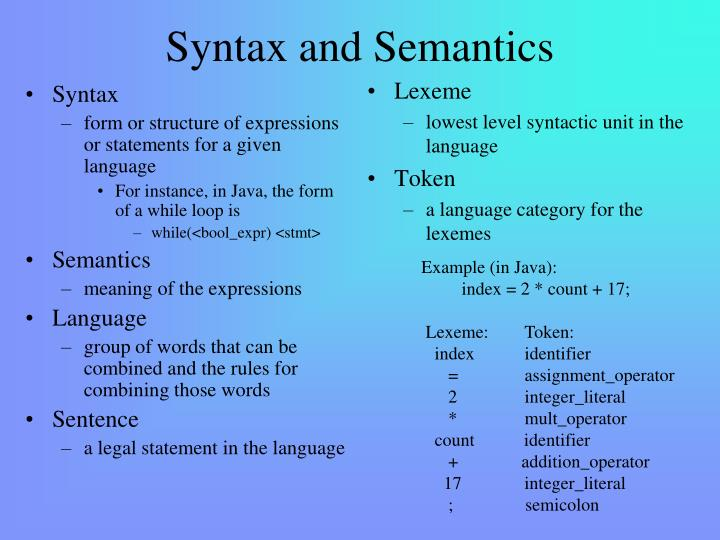

# JavaScript
**JavaScript** is a fun and flexible programming language. It’s one of the core technologies of web development and can be used on both the front-end and the back-end. , JavaScript is among the most powerful and flexible programming languages of the web. It powers the dynamic behavior on most websites, including this one.

### Why we love it:
+ Versatile and robust
+ Front-End friendly
+ Back-End friendly
+ Enables web applications
+ Game Development
+ Mobile Apps

>In JavaScript, consider a function that takes a string parameter, and returns an < li> element with that string as its textContent. Would you need to look at the code to understand what the function did if it was called build(‘Peach’), or createLiWithContent(‘Peach’)?
We can distinguish 3 major parts of what we usually refer to as “JavaScript”:
The language itself. This is fairly standard among the various environments, both in the various browsers and in the various server-side environments.
The DOM API - how the language can interact with the various parts of a web page while in the browser. While in this respect the various browsers are getting closer to each other they still differ. Several libraries, most prominently JQuery, is trying to provide a unified API.
The server API (or just API) provided by Node.js or one of the other server-side systems.
** JavaScript input with prompt and confirm: ** Visit JS prompt and confirm (Links to an external site.)
The fist one is called prompt: It will show a pop-up window with the text provided as the first parameter and with a textbox the user can fill in. When the user presses OK, the value in the text box will be returned by the prompt() function. Then, in this example we use the document.write method to update the html with the text.
examples/js/prompt.html

