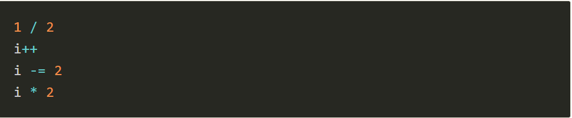
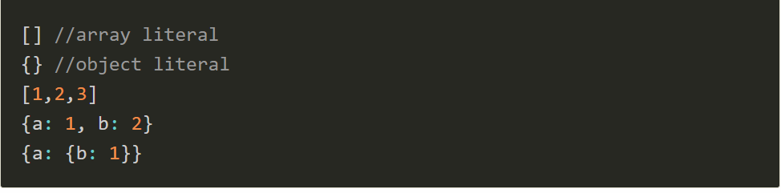
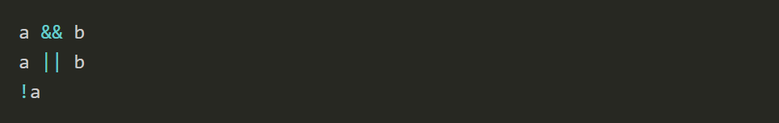
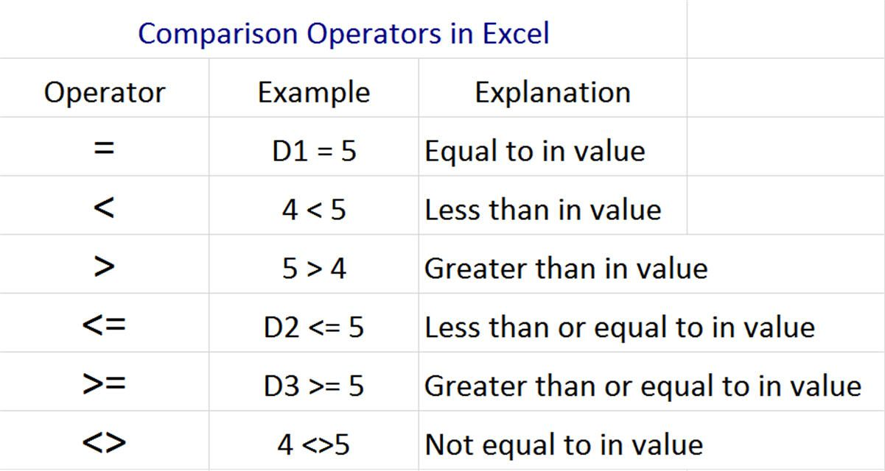
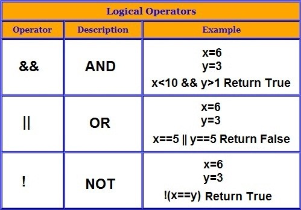
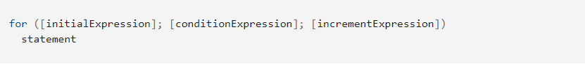
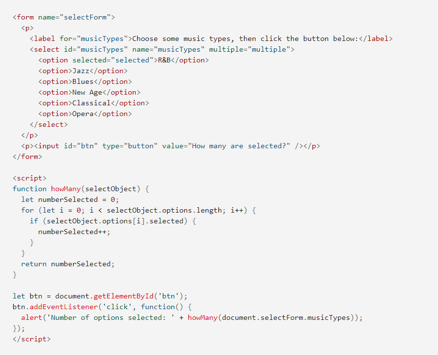
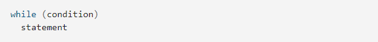
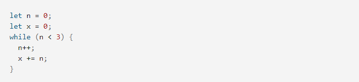

# **Expressions**

expressions are units of code that can be evaluated and resolve to a value. Expressions in JS can be divided in categories
### 1.Arithmetic expressions

### 2.String expressions

### 3.Primary expressions

### 4.Array and object initializers expressions

### 5.Logical expressions

### 6.Left-hand-side expressions

### 7.Property access expressions

### 8.Object creation expressions

### 9.Function definition expressions

***

# **Operators**
### 1. Assignment operators
> An assignment operator assigns a value to its left operand based on the value of its right operand. The simple assignment operator is equal (=), which assigns the value of its right operand to its left operand. That is, x = y assigns the value of y to x.
There are also compound assignment operators that are shorthand for the operations listed in the following table:

### 2. Comparison operators
>A comparison operator compares its operands and returns a logical value based on whether the comparison is true. The operands can be numerical, string, logical, or object values. Strings are compared based on standard lexicographical ordering, using Unicode values. In most cases, if the two operands are not of the same type, JavaScript attempts to convert them to an appropriate type for the comparison. This behavior generally results in comparing the operands numerically. The sole exceptions to type conversion within comparisons involve the === and !== operators, which perform strict equality and inequality comparisons. These operators do not attempt to convert the operands to compatible types before checking equality. The following table describes the comparison operators in terms of this sample code:

### 3. Arithmetic operators
>An arithmetic operator takes numerical values (either literals or variables) as their operands and returns a single numerical value. The standard arithmetic operators are addition (+), subtraction (-), multiplication (*), and division (/). These operators work as they do in most other programming languages when used with floating point numbers (in particular, note that division by zero produces Infinity). For example:

### 4. Logical operators
> Logical operators are typically used with Boolean (logical) values; when they are, they return a Boolean value. However, the && and || operators actually return the value of one of the specified operands, so if these operators are used with non-Boolean values, they may return a non-Boolean value. The logical operators are described in the following table.

# **Loops and iteration**
>Loops offer a quick and easy way to do something repeatedly, 
You can think of a loop as a computerized version of the game where you tell someone to take X steps in one direction, then Y steps in another. For example, the idea "Go five steps to the east" could be expressed this way as a loop
There are many different kinds of loops, but they all essentially do the same thing: they repeat an action some number of times. (Note that it's possible that number could be zero!)

The various loop mechanisms offer different ways to determine the start and end points of the loop. There are various situations that are more easily served by one type of loop over the others.

***

## The statements for loops provided in JavaScript are:

### + **For statement ** 
A for loop repeats until a specified condition evaluates to false. The JavaScript for loop is similar to the Java and C for loop.

A for statement looks as follows:

When a for loop executes, the following occurs:

1. The initializing expression initialExpression, if any, is executed. This expression usually initializes one or more loop counters, but the syntax allows an expression of any degree of complexity. This expression can also declare variables.
2. The conditionExpression expression is evaluated. If the value of conditionExpression is true, the loop statements execute. If the value of condition is false, the for loop terminates. (If the condition expression is omitted entirely, the condition is assumed to be true.)
3. The statement executes. To execute multiple statements, use a block statement ({ ... }) to group those statements.

4. If present, the update expression incrementExpression is executed.

#### Example
> In the example below, the function contains a for statement that counts the number of selected options in a scrolling list (a <select> element that allows multiple selections). The for statement declares the variable i and initializes it to 0. It checks that i is less than the number of options in the <select> element, performs the succeeding if statement, and increments i by after each pass through the loop.

###  **while statement**
A while statement executes its statements as long as a specified condition evaluates to true. A while statement looks as follows:

If the *condition *becomes false, statement within the loop stops executing and control passes to the statement following the loop.

The condition test occurs before statement in the loop is executed. If the condition returns true, statement is executed and the condition is tested again. If the condition returns false, execution stops, and control is passed to the statement following while.

To execute multiple statements, use a block statement ({ ... }) to group those statements.
#### Example
The following while loop iterates as long as n is less than 3:
