#  **Expressions**

expressions are units of code that can be evaluated and resolve to a value. Expressions in JS can be divided in categories
### 1.Arithmetic expressions
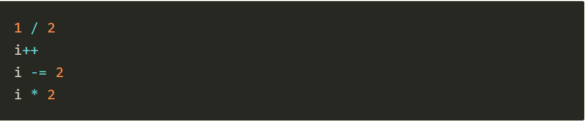
### 2.String expressions
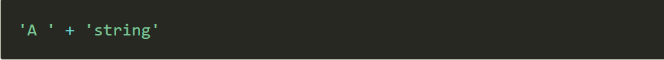
### 3.Primary expressions
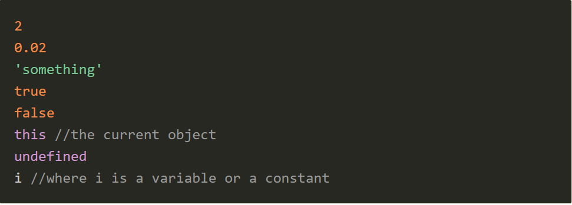
### 4.Array and object initializers expressions
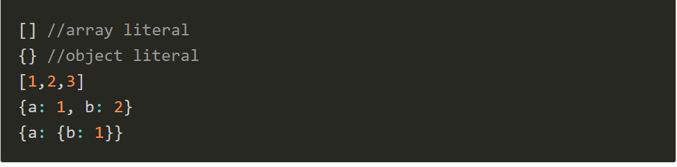
### 5.Logical expressions
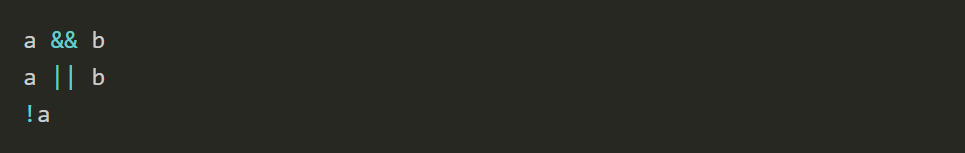
### 6.Left-hand-side expressions
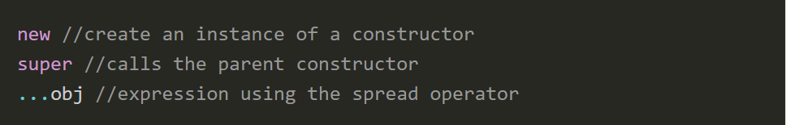
### 7.Property access expressions
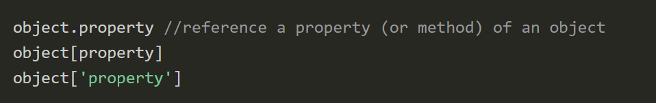
### 8.Object creation expressions
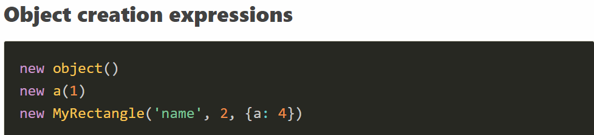
### 9.Function definition expressions
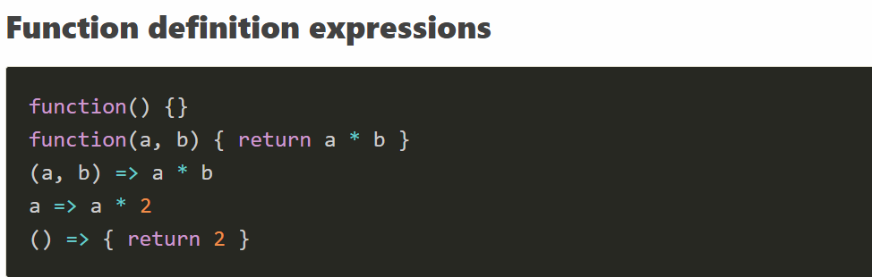

***

# **Operators**
### 1. Assignment operators
> An assignment operator assigns a value to its left operand based on the value of its right operand. The simple assignment operator is equal (=), which assigns the value of its right operand to its left operand. That is, x = y assigns the value of y to x.
There are also compound assignment operators that are shorthand for the operations listed in the following table:
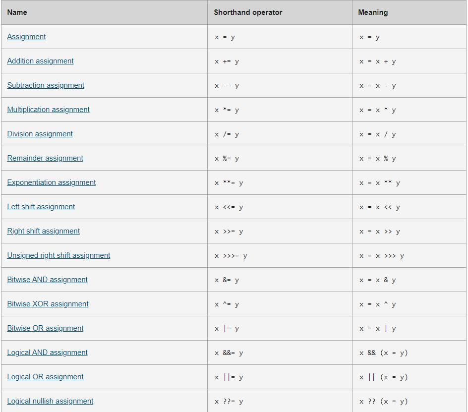

### 2. Comparison operators
>A comparison operator compares its operands and returns a logical value based on whether the comparison is true. The operands can be numerical, string, logical, or object values. Strings are compared based on standard lexicographical ordering, using Unicode values. In most cases, if the two operands are not of the same type, JavaScript attempts to convert them to an appropriate type for the comparison. This behavior generally results in comparing the operands numerically. The sole exceptions to type conversion within comparisons involve the === and !== operators, which perform strict equality and inequality comparisons. These operators do not attempt to convert the operands to compatible types before checking equality. The following table describes the comparison operators in terms of this sample code:
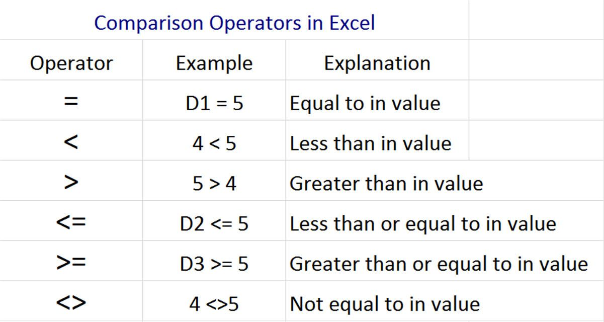

### 3. Arithmetic operators
>An arithmetic operator takes numerical values (either literals or variables) as their operands and returns a single numerical value. The standard arithmetic operators are addition (+), subtraction (-), multiplication (*), and division (/). These operators work as they do in most other programming languages when used with floating point numbers (in particular, note that division by zero produces Infinity). For example:

### 4. Logical operators
> Logical operators are typically used with Boolean (logical) values; when they are, they return a Boolean value. However, the && and || operators actually return the value of one of the specified operands, so if these operators are used with non-Boolean values, they may return a non-Boolean value. The logical operators are described in the following table.
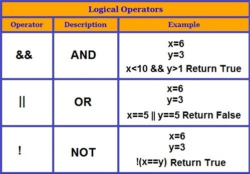

# **Loops and iteration**
>Loops offer a quick and easy way to do something repeatedly, 
You can think of a loop as a computerized version of the game where you tell someone to take X steps in one direction, then Y steps in another. For example, the idea "Go five steps to the east" could be expressed this way as a loop
There are many different kinds of loops, but they all essentially do the same thing: they repeat an action some number of times. (Note that it's possible that number could be zero!)

The various loop mechanisms offer different ways to determine the start and end points of the loop. There are various situations that are more easily served by one type of loop over the others.

****
****

# **Function**

> Functions are one of the fundamental building blocks in JavaScript. A function in JavaScript is similar to a procedure—a set of statements that performs a task or calculates a value, but for a procedure to qualify as a function, it should take some input and return an output where there is some obvious relationship between the input and the output. To use a function, you must define it somewhere in the scope from which you wish to call it.

# Defining functions

+ A function definition (also called a function declaration, or function statement) consists of the function keyword, followed by:

+ The name of the function.
+ A list of parameters to the function, enclosed in parentheses and separated by commas.
+ The JavaScript statements that define the function, enclosed in curly brackets, {...}.
+ For example, the following code defines a simple function named square:
+ function square(number) {
+ return number * number;
}

# Calling functions
>Defining a function does not execute it. Defining it names the function and specifies what to do when the function is called.
 Calling the function actually performs the specified actions with the indicated parameters. For example, if you define the function square, you could call it as follows:

# Function scope
> Variables defined inside a function cannot be accessed from anywhere outside the function, because the variable is defined only in the scope of the function. However, a function can access all variables and functions defined inside the scope in which it is defined.

#### In other words, a function defined in the global scope can access all variables defined in the global scope. A function defined inside another function can also access all variables defined in its parent function, and any other variables to which the parent function has access.

